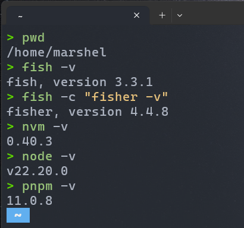

# Actividad 1 — Primer Proyecto en Vite

---

## Información del Estudiante

| Campo        | Detalle                              |
|--------------|--------------------------------------|
| 👤 Nombre    | Marshel Aillón                       |
| 🎓 Materia    | Programación para Dispositivos Móviles II |
| 🏫 Institución | TECBA                               |
| 📅 Fecha      | 08 de mayo, 2025                     |
| 👨‍🏫 Docente   | Gary Guzmán                          |

---

## Descripción

Primer proyecto creado con **Vite + React** como parte de la Actividad 1.  
Incluye la configuración del entorno de desarrollo con las herramientas requeridas por la materia.

## Herramientas utilizadas

- 🐟 **fish** — Shell alternativo
- 🎣 **fisher** — Plugin manager para fish
- 📦 **nvm** — Node Version Manager
- 🟢 **node** — Entorno de ejecución JavaScript
- ⚡ **pnpm** — Gestor de paquetes
- ⚡ **Vite** — Bundler y entorno de desarrollo

---

## Captura del entorno



---

## Cómo correr el proyecto

```bash
pnpm install
pnpm run dev
```
